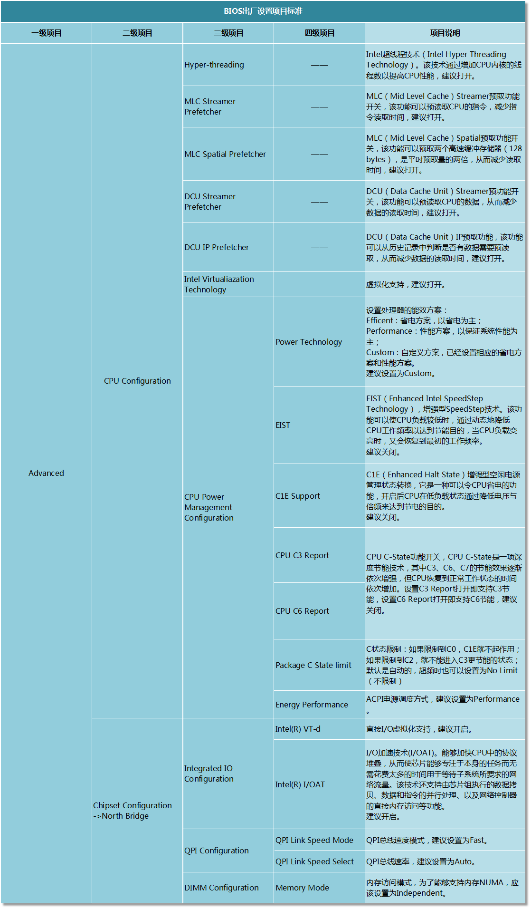

# bios 设置

有关BIOS主要设置项的说明：

1. 处理器节电相关：C1E、C-State、电源模式、EIST等；

2. 内存NUMA模式和访问速率等；

3. 处理器超线程、虚拟化和直接IO访问等；

4. 处理器指令优化：MLC、DCU等；

> 对应项 设置图解 

-----------

# 家用服务器指定

## CPU

1. Hyper-threading 开启
2. MLC Stream 开启
3. MLC Spatial 开启
4. DCU Stream 开启
5. DCU IP 开启
6. Intel virtual 开启

## 电池

1. Power  省电
2. EIST   开启
3. C1E    开启
4. CPU C7 Report  打开为C7 深度节能
5. Energy 修改为节能

## IO

1. Intel VT-d 开启
2. Tntel I/O AT 开启
3. QPI 设置为自动