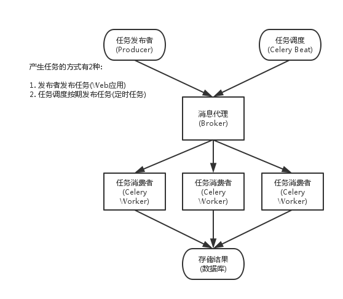

# 理解

Celery 是一个专注于实时处理和任务调度的分布式任务队列。
所谓任务就是消息，消息中的有效载荷中包含要执行任务需要的全部数据。

## 使用 Celery 的常见场景如下：

1. Web 应用。
   当用户触发的一个操作需要较长时间才能执行完成时，可以把它作为任务交给 Celery 去异步执行，执行完再返回给用户。这段时间用户不需要等待，提高了网站的整体吞吐量和响应时间。

2. 定时任务。
   生产环境经常会跑一些定时任务。假如你有上千台的服务器、上千种任务，定时任务的管理很困难，Celery 可以帮助我们快速在不同的机器设定不同种任务。

3. 同步完成的附加工作都可以异步完成。
   比如发送短信/邮件、推送消息、清理/设置缓存等。

## Celery 还提供了如下的特性：

1. 方便地查看定时任务的执行情况，比如执行是否成功、当前状态、执行任务花费的时间等。

2. 可以使用功能齐备的管理后台或者命令行添加、更新、删除任务。

3. 方便把任务和配置管理相关联。

4. 可选多进程、Eventlet 和 Gevent 三种模式并发执行。

5. 提供错误处理机制。

- 提供多种任务原语，方便实现任务分组、拆分和调用链。
- 支持多种消息代理和存储后端。

---

## Celery 的架构

Celery 包含如下组件：

1. Celery Beat：任务调度器，`Beat` 进程会读取配置文件的内容，周期性地将配置中到期需要执行的任务发送给任务队列。

2. `Celery Worker`：执行任务的消费者，通常会在多台服务器运行多个消费者来提高执行效率。

3. `Broker`：消息代理，或者叫作消息中间件，接受任务生产者发送过来的任务消息，存进队列再按序分发给任务消费方（通常是消息队列或者数据库）。

4. `Producer`：调用了 `Celery` 提供的 API、函数或者装饰器而产生任务并交给任务队列处理的都是任务生产者。

5. `Result Backend`：任务处理完后保存状态信息和结果，以供查询。
   `Celery` 默认已支持 `Redis`、`RabbitMQ`、`MongoDB`、`Django ORM`、`SQLAlchemy` 等方式。

### Celery 的架构图

> 工作流程

1. 当在代码中调用`Celery`方法时，作为 `Producer` 将会主动连接 `broker` (使用 `pidfile` 或者 网络接口 例：`redis，rabbitmq`)
2. 进行任务注册添加，
3. 供`worker`主动连接`broker`，然后获取任务执行
4. `worker` 将结果写入 `resukt`

> 或者产生任务的还可以是 任务调度者`beat`,定时产生任务

### Celery 序列化

在客户端和消费者之间传输数据需要序列化和反序列化

## celery 中的 worker 并发和多 worker

> 实际上都是在实现并发

单 `worker` 可以开 `n` 个进程进行工作，一个 `worker` 挂了往往所有进程都会挂掉
多 `worker` 假设为 `m` 个，可以理解为分布式，为了防止一个 `worker` 挂了(或者性能不足等原因)，导致无法工作,那么能够并发处理的任务数量理论上为 `m * n`

一般 `worker`(不仅 `celery`,很多设计都是这样)指**一个调度主进程** + **多个子工作进程**

### 一个 worker 有什么缺点：

如果这个 worker 的主进程挂了，那么整个任务系统都崩了。
再往深点，如果你服务端 master 发送的任务速度很快，远大于 `worker` 主进程去分发任务的速度，可能会影响效率(但这种情况很少，而且这种框架一般都是容忍延迟的)
部署 worker 这台机器挂了，那么任务系统都崩了
这台机器的资源(cpu，内存，IO 等)无法满足你的需求

### 比较常见的是在不同机器部署多个 worker

在不考虑机器和进程挂掉但情况，其实一个 worker 开 8 个进程和 2 个 worker 每个开 4 个进程的效率是接近的

celery 里面的`-c` 参数指定的是并发度
而`-P` 参数指定并发的实现方式，有 `prefork (default)、eventlet、gevent` 等，`prefork` 就是多进程的方式去实现并发。

> 理多 `worker` 对应到多个进程，每个 `worker` （进程）自己内部还能并发是 `gunicorn` 的方式。
> `gunicorn` 的`-w` 参数指定有几个 `worker` （即几个进程），`-k` 参数指定每个 `worker` 的并发方式，可以是多线程或者多协程
> 也可以指定为 `sync`，表示 worker 是同步的，即不能并发。

比如 `gunicorn` 的`-w 10 -k sync` 和 `celery` 的`-c 10 -P prefork` 是等价的，都是创建 `10` 个进程去做并发，并发度最高就是 `10`。

> 同一 worker 下 的并发

再例如 `celery` 的`-c 10 -P gevent` 表示创建 `10` 个 `gevent` 协程去做并发，最高并发度也是 `10`。
而 `gunicorn` 的`-w 10 -k gevent`，表示的是创建 `10` 个进程，且每个进程都是 `gevent` 异步的，这个并发度就很高了。
