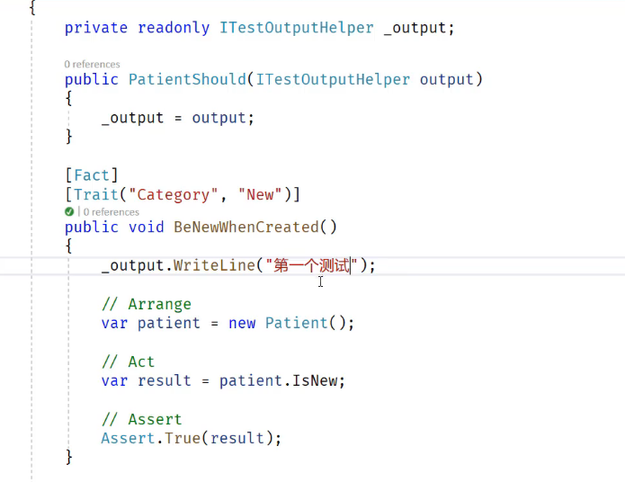

# 使用

## 测试分组

`[Trait("name","Value")]`

1.  方法前加装饰器 Trait ，用来分类 测试 法
2.  Class 前加装饰器 Trait ，用来分类 测试类

> 一个前可加多个`Trait`

## 忽略指定测试

`[Fact(Skip="字符串S")]`

前加该 装饰器 ，不测试该方法或类，输出显示 字符串 S

## 自定义输出内容

`ITestOutputHelper` 类

## 共享上下文
