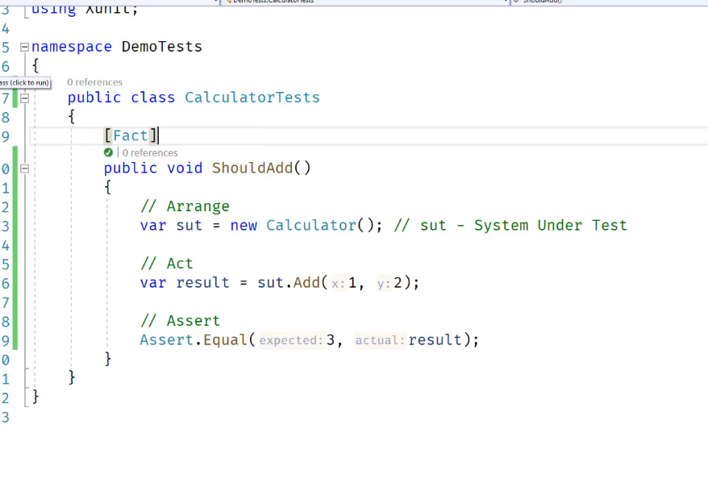
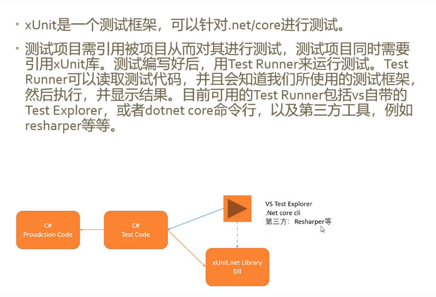

# 测试

## 目的

1. 可以频繁进行测试
2. 在任何时间进行测试 ，可以制定计划测试
3. 比人工要快
4. 快速发现错误
5. 测试代码与生产紧密结合

## 分类

1. 单元测试

   测试一个类，一个方法

2. 集成测试

   整合测试模块，以及外部资源（如数据库，网路等等）

> 1，2 为代码开发人员自写测试

3. 皮下测试

   UI 层的下一层

4. UI 测试

## 测试阶段

1. Arrange 先决的指定

   例如创建 对象实例，数据，输入等等

2. Act 执行代码并返回结果

   调用方法或设置属性

3. Assert 判断结果一致性

   测试通过或者失败

## xUnity 简介

官网：<https://xunit.net/>

### 使用流程

### 特点

1. 多平台运行时

2. 并行测试

3. 数据驱动测试

4. 可扩展
